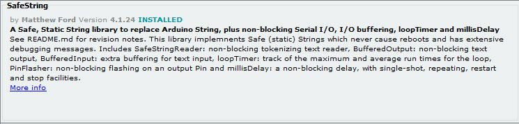
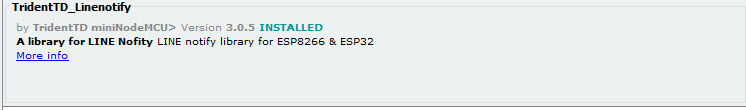
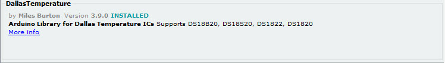
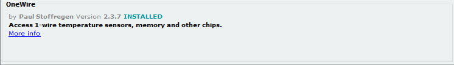

# FIT_FishFeeder System V.1.3 (Refined)


ระบบแจ้งเตือนระดับอาหารปลาอัตโนมัติผ่าน Line Notify พัฒนาโดย **IoTES LAB, Nakhon Phanom University**

## Key Features
- **Security:** แยกข้อมูล WiFi และ Line Token ไว้ใน `secrets.h` (กันข้อมูลรั่วไหล)
- **Robustness:** มีระบบ Auto Reconnect หาก WiFi หลุด
- **Accuracy:** ใช้ **Moving Average Filter** ลด Noise จากเซ็นเซอร์ Ultrasonic
- **Efficiency:** แจ้งเตือนผ่าน Line เฉพาะเมื่อมีการเปลี่ยนแปลงระดับอาหาร (ป้องกันการ Spam)

## Hardware Setup
- **Microcontroller:** ESP32 / ESP8266
- **Sensor:** HC-SR04 (Ultrasonic Sensor)

### Pin Mapping
| Sensor Pin | ESP32 GPIO | Description |
|------------|------------|-------------|
| Trig       | 5          | Trigger Pin |
| Echo       | 18         | Echo Pin    |

## Installation & Setup
1. ติดตั้ง Library ต่อไปนี้ใน Arduino IDE:
   - `TridentTD_LineNotify`
   - `millisDelay`
2. สร้างไฟล์ `secrets.h` ในโฟลเดอร์เดียวกับโปรเจค (หรือใช้ไฟล์ที่ระบบสร้างให้)
3. ใส่ข้อมูล WiFi และ Line Token ใน `secrets.h`:
   ```cpp
   #define WIFI_SSID        "YOUR_SSID"
   #define WIFI_PASSWORD    "YOUR_PASSWORD"
   #define LINE_NOTIFY_TOKEN  "YOUR_TOKEN"
   ```
4. Upload โค้ดลงบอร์ด

## Documentation Images





---
*Maintained by Mori Minami (Mina) - Engineering Advisor*
